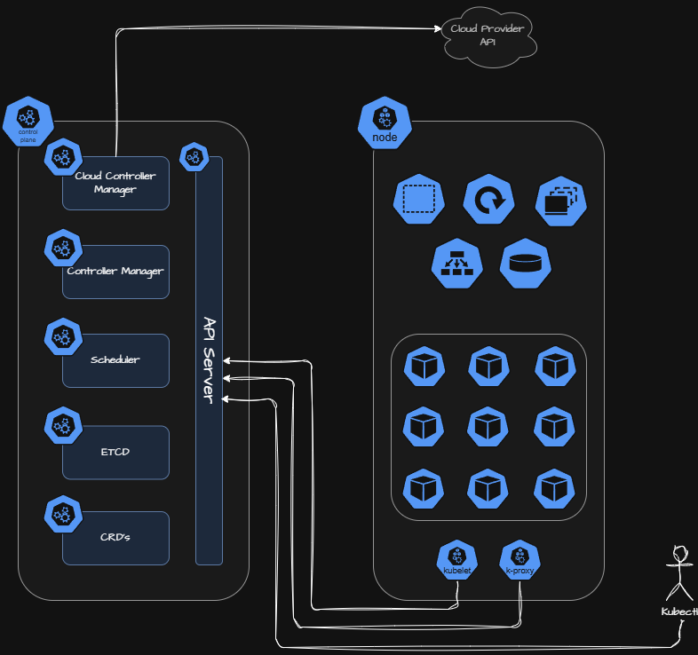
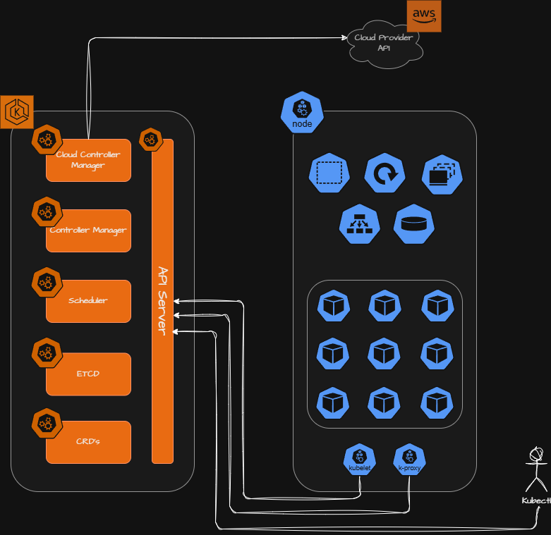
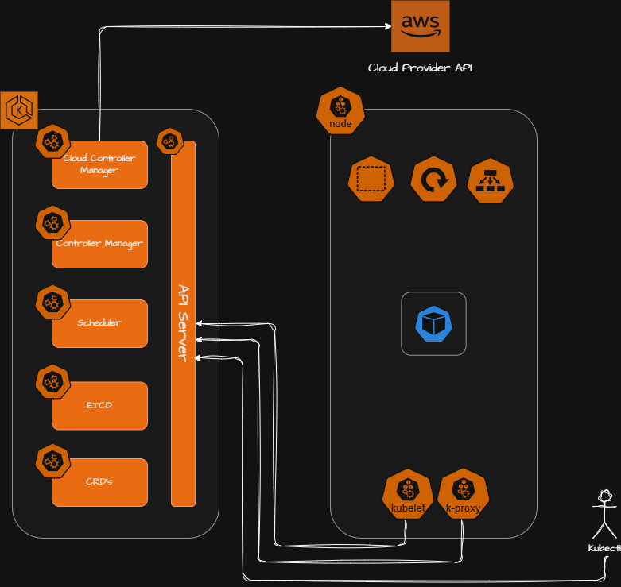
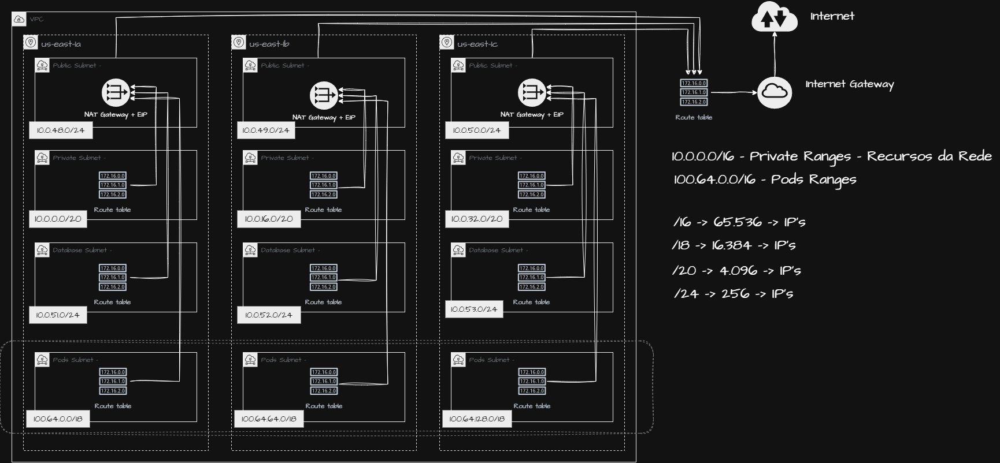

# Module 1: EKS Fundamentals and Networking Foundation

Welcome to Module 1 of the LinuxTips EKS Learning Path.

This module establishes the architectural foundation for the entire course.  
We start by understanding Amazon EKS usage models and then design a production-grade networking architecture to support scalable Kubernetes workloads.

The main focus of this module is network design, infrastructure setup, and Terraform structure.

---

## 1. Introduction to Amazon EKS

### What is Amazon EKS?

Amazon EKS (Elastic Kubernetes Service) is a fully managed Kubernetes control plane provided by AWS.

With EKS:

- AWS manages the Control Plane (API Server, etcd, Scheduler, Controller Manager)
- You manage:
  - Worker nodes (unless using Fargate)
  - Capacity strategies
  - Add-ons
  - Applications
  - Governance

EKS allows you to operate Kubernetes clusters with high availability, scalability, and integration with AWS services.

---

## 2. EKS Usage Models

Before implementing infrastructure, it’s critical to understand the operational models available:

### 2.1 Self-Managed Kubernetes

You manage everything:

- Control Plane
- etcd
- Scheduler
- Nodes
- Cloud integrations

Maximum flexibility — maximum complexity.



---

### 2.2 EKS Managed Control Plane (Standard Model)

AWS manages:

- API Server
- etcd cluster
- Control Plane HA
- Cloud Provider integrations

You manage:

- Worker Nodes
- Node Groups
- Capacity
- Add-ons
- Workloads

This is the most commonly used production model.



---

### 2.3 EKS with Fargate

AWS manages:

- Control Plane
- Worker Nodes (Fargate-managed nodes)

Important detail:

- Each Pod runs inside its own Fargate node
- You do NOT provision the node manually
- AWS provisions infrastructure per Pod

Trade-offs:

- Higher cost
- Less flexibility
- No direct node control



---

## 3. Course Methodology

This course is designed to:

- Implement multiple solutions for the same problem
- Compare architectural approaches
- Build critical decision-making skills
- Apply Infrastructure as Code best practices
- Use GitHub as portfolio building

We will:

- Implement
- Destroy
- Rebuild using alternative strategies

There is no single “correct” approach — architecture decisions depend on context.

---

## 4. Required Tooling

Before proceeding, the following tools must be installed:

- Terraform
- tfenv or tfswitch
- AWS CLI
- kubectl

These tools are mandatory for following the hands-on labs.

---

## 5. Initial AWS Setup

### 5.1 Create S3 Bucket for Terraform State

The S3 bucket will store remote Terraform state files.

Example:

```txt
linuxtips-eks-state-file
```

---

### 5.2 Create IAM User for Terraform

- Create IAM user
- Attach AdministratorAccess (lab environment only)
- Generate Access Key
- Configure AWS CLI:

```bash
aws configure
```

Test authentication:

```bash
aws s3 ls
```

---

## 6. Networking Architecture Design

Networking is the most critical foundation for scalable Kubernetes environments.

### CIDR Strategy

Primary VPC CIDR:

```bash
10.0.0.0/16
```

Secondary CIDR (Dedicated for Pods):

```bash
100.64.0.0/16
```

### Why CIDR Segmentation?

Kubernetes is IP-intensive:

- Each node consumes multiple IPs
- Each Pod consumes IPs
- VPC CNI allocates IPs per ENI

To avoid IP exhaustion:

- Separate infrastructure CIDR
- Separate Pod CIDR

---

## 7. Subnet Strategy

### Public Subnets
- /24
- NAT Gateways
- Load Balancers

### Private Subnets
- /20
- Worker nodes
- Internal services

### Database Subnets
- /24
- No Internet access

### Pod Subnets
- /18
- Dedicated for high Pod density

---

## 8. High Availability Design

- 3 Availability Zones
- 1 NAT Gateway per AZ
- 1 Elastic IP per NAT Gateway

Benefits:

- Zone-level isolation
- Reduced blast radius
- Stable outbound IP addresses
- Partner firewall whitelisting capability

---

## 9. Public Subnets and Internet Gateway

The first networking components implemented are the public subnets, which will host:

- Load Balancers
- NAT Gateways
- Public-facing services

To make the infrastructure scalable and reusable, we define the public subnets as a list of objects.

---

## 10. Final Architecture

At the end of this module we have a fully production-ready VPC architecture.

Infrastructure components created:

- VPC with primary and secondary CIDR
- Public Subnets
- Private Subnets
- Pod Subnets
- Database Subnets
- Internet Gateway
- NAT Gateways per Availability Zone
- Route Tables
- Network ACL security layer
- Parameter Store shared infrastructure values

This networking foundation supports highly scalable Kubernetes workloads on Amazon EKS.

In the next module we will begin the EKS Control Plane deployment.


