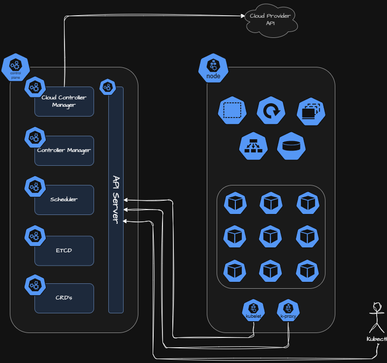
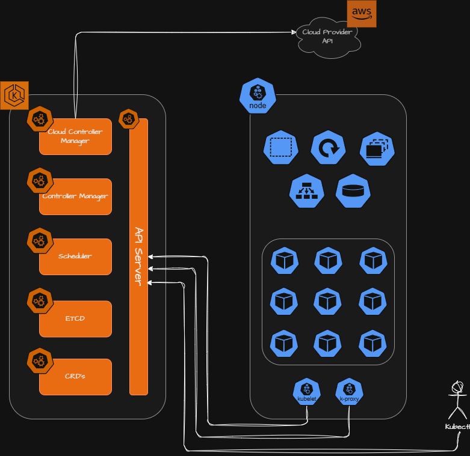
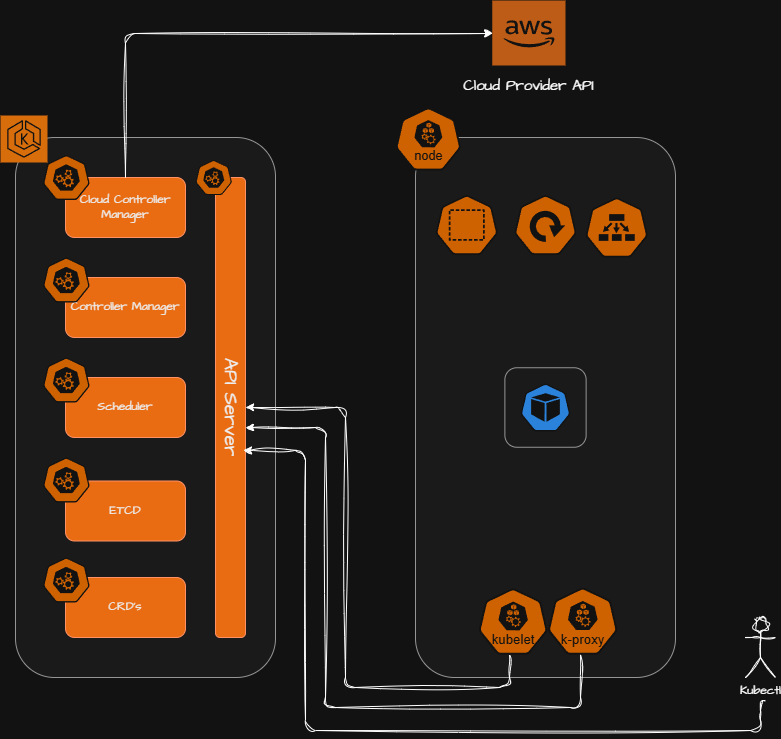
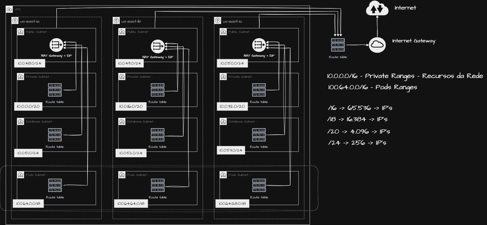

# Module 1: EKS Fundamentals and Networking Foundation

## Overview

Welcome to Module 1 of the LinuxTips EKS Learning Path.

This module establishes the architectural foundation for the entire course.  
We start by understanding Amazon EKS usage models and then design a production-grade networking architecture to support scalable Kubernetes workloads.

The main focus of this module is network design, infrastructure setup, and Terraform structure.

## Table of Contents

- [1. Introduction to Amazon EKS](#1-introduction-to-amazon-eks)
  - [What is Amazon EKS?](#what-is-amazon-eks)
- [2. EKS Usage Models](#2-eks-usage-models)
  - [Self-Managed Kubernetes](#self-managed-kubernetes)
  - [EKS Managed Control Plane (Standard Model)](#eks-managed-control-plane-standard-model)
  - [EKS with Fargate](#eks-with-fargate)
- [3. Course Methodology](#3-course-methodology)
- [4. Required Tooling](#4-required-tooling)
- [5. Initial AWS Setup](#5-initial-aws-setup)
  - [Create S3 Bucket for Terraform State](#create-s3-bucket-for-terraform-state)
  - [Create IAM User for Terraform](#create-iam-user-for-terraform)
- [6. Networking Architecture Design](#6-networking-architecture-design)
  - [CIDR Strategy](#cidr-strategy)
  - [Why CIDR Segmentation?](#why-cidr-segmentation)
- [7. Subnet Strategy](#7-subnet-strategy)
  - [Public Subnets](#public-subnets)
  - [Private Subnets](#private-subnets)
  - [Database Subnets](#database-subnets)
  - [Pod Subnets](#pod-subnets)
- [8. High Availability Design](#8-high-availability-design)
- [9. Public Subnets and Internet Gateway](#9-public-subnets-and-internet-gateway)
- [10. Parameter Store Integration](#10-parameter-store-integration)
- [11. Final Architecture](#11-final-architecture)
- [Full Code](#full-code)

---

## 1. Introduction to Amazon EKS

### What is Amazon EKS?

Amazon EKS (Elastic Kubernetes Service) is a fully managed Kubernetes control plane provided by AWS.

With EKS:

- AWS manages the Control Plane (API Server, etcd, Scheduler, Controller Manager)
- You manage:
  - Worker nodes (unless using Fargate)
  - Capacity strategies
  - Add-ons
  - Applications
  - Governance

EKS allows you to operate Kubernetes clusters with high availability, scalability, and integration with AWS services.

---

## 2. EKS Usage Models

Before implementing infrastructure, it’s critical to understand the operational models available:

### Self-Managed Kubernetes

You manage everything:

- Control Plane
- etcd
- Scheduler
- Nodes
- Cloud integrations

Maximum flexibility — maximum complexity.



---

### EKS Managed Control Plane (Standard Model)

AWS manages:

- API Server
- etcd cluster
- Control Plane HA
- Cloud Provider integrations

You manage:

- Worker Nodes
- Node Groups
- Capacity
- Add-ons
- Workloads

This is the most commonly used production model.



---

### EKS with Fargate

AWS manages:

- Control Plane
- Worker Nodes (Fargate-managed nodes)

Important detail:

- Each Pod runs inside its own Fargate node
- You do NOT provision the node manually
- AWS provisions infrastructure per Pod

Trade-offs:

- Higher cost
- Less flexibility
- No direct node control



---

## 3. Course Methodology

This course is designed to:

- Implement multiple solutions for the same problem
- Compare architectural approaches
- Build critical decision-making skills
- Apply Infrastructure as Code best practices
- Use GitHub as portfolio building

We will:

- Implement
- Destroy
- Rebuild using alternative strategies

There is no single “correct” approach — architecture decisions depend on context.

---

## 4. Required Tooling

Before proceeding, the following tools must be installed:

- Terraform
- tfenv or tfswitch
- AWS CLI
- kubectl

These tools are mandatory for following the hands-on labs.

---

## 5. Initial AWS Setup

### Create S3 Bucket for Terraform State

Terraform state is never committed to git — it's stored remotely in S3 so the state survives across machines and can be shared safely. The project declares an empty, partial backend block and fills in the real values through a `-backend-config` file at init time, so no bucket name or region is hardcoded into the module itself:

```hcl
terraform {
  backend "s3" {

  }
}
```

The actual values are supplied via a `backend.tfvars` file (kept out of git, only an `.example` is committed):

```hcl
bucket  = "<your-project>-state-file"
key     = "eks/vpc/prod/state"
region  = "us-east-1"
profile = "personal"
```

> **Note:** the bucket name above is a placeholder — use a globally unique name for your own AWS account. `key` is the path inside the bucket where this environment's state is stored, which is what lets you keep separate state files per environment (`prod`, `staging`, etc.) in the same bucket.

Initialize Terraform against that backend:

```bash
terraform init -backend-config=environment/prod/backend.tfvars
```

---

### Create IAM User for Terraform

- Create IAM user
- Attach AdministratorAccess (lab environment only)
- Generate Access Key
- Configure AWS CLI:

```bash
aws configure
```

Test authentication:

```bash
aws s3 ls
```

---

## 6. Networking Architecture Design

Networking is the most critical foundation for scalable Kubernetes environments.

### CIDR Strategy

The VPC is provisioned with a primary CIDR, plus a second CIDR block associated afterward:

```hcl
resource "aws_vpc" "main" {
  cidr_block = var.vpc_cidr

  enable_dns_hostnames = true
  enable_dns_support   = true

  tags = {
    Name = var.project_name
  }
}

resource "aws_vpc_ipv4_cidr_block_association" "main" {
  count = length(var.vpc_additional_cidrs)

  vpc_id     = aws_vpc.main.id
  cidr_block = var.vpc_additional_cidrs[count.index]
}
```

Primary VPC CIDR (infrastructure — nodes, load balancers, control-plane ENIs):

```txt
10.0.0.0/16
```

Secondary CIDR, associated on top of the VPC (dedicated to Pods):

```txt
100.64.0.0/16
```

`vpc_additional_cidrs` is a list, looped with `count`, so the VPC can grow additional CIDR blocks later without touching the base `aws_vpc` resource — that's the mechanism that makes the Pod CIDR an *addition* to the VPC rather than a carve-out of the primary block.

### Why CIDR Segmentation?

Kubernetes is IP-intensive:

- Each node consumes multiple IPs
- Each Pod consumes IPs
- VPC CNI allocates IPs per ENI

A single `/16` (65,536 addresses) sounds like a lot, but once every Pod gets a routable VPC IP, a handful of large node groups can burn through it fast. Splitting infrastructure and Pods into two separate CIDR ranges means:

- Separate infrastructure CIDR (`10.0.0.0/16`) — sized for nodes, load balancers, databases
- Separate Pod CIDR (`100.64.0.0/16`) — sized for the actual Pod count, independent of how many nodes exist

---

## 7. Subnet Strategy

### Public Subnets

3 subnets, one per Availability Zone, each a `/24`:

| Name | CIDR | AZ |
|---|---|---|
| `linuxtips-public-1a` | `10.0.48.0/24` | `us-east-1a` |
| `linuxtips-public-1b` | `10.0.49.0/24` | `us-east-1b` |
| `linuxtips-public-1c` | `10.0.50.0/24` | `us-east-1c` |

All three share a single route table pointing to the Internet Gateway:

```hcl
resource "aws_route_table" "public_internet_access" {
  vpc_id = aws_vpc.main.id
}

resource "aws_route" "public" {
  route_table_id         = aws_route_table.public_internet_access.id
  destination_cidr_block = "0.0.0.0/0"

  gateway_id = aws_internet_gateway.main.id
}
```

These subnets host Load Balancers and the NAT Gateways (see [Private Subnets](#private-subnets) below for the actual NAT Gateway resource) — nothing here is meant to run workloads directly.

### Private Subnets

3 `/20` subnets, one per AZ — large enough to host worker nodes and their Pod ENIs:

| Name | CIDR | AZ |
|---|---|---|
| `linuxtips-private-1a` | `10.0.0.0/20` | `us-east-1a` |
| `linuxtips-private-1b` | `10.0.16.0/20` | `us-east-1b` |
| `linuxtips-private-1c` | `10.0.32.0/20` | `us-east-1c` |

Private subnets have no direct route to the Internet Gateway. Outbound-only internet access is provided by a NAT Gateway — and that NAT Gateway is provisioned one per AZ, sitting in the *public* subnet of the same AZ, even though it exists to serve the *private* subnet's traffic:

```hcl
resource "aws_eip" "eip" {
  count = length(var.public_subnets)

  domain = "vpc"
}

resource "aws_nat_gateway" "main" {
  count = length(var.public_subnets)

  allocation_id = aws_eip.eip[count.index].id
  subnet_id     = aws_subnet.public[count.index].id
}
```

Each private subnet then gets its own route table, routing `0.0.0.0/0` to the NAT Gateway that lives in the matching AZ:

```hcl
resource "aws_route" "private" {
  count = length(var.private_subnets)

  route_table_id         = aws_route_table.private[count.index].id
  destination_cidr_block = "0.0.0.0/0"

  nat_gateway_id = aws_nat_gateway.main[
    index(
      var.public_subnets[*].availability_zone,
      var.private_subnets[count.index].availability_zone
    )
  ].id
}
```

The `index()` lookup is what pairs each private subnet with the NAT Gateway in its own AZ, instead of funneling every private subnet through a single shared NAT Gateway — this is what makes the design zone-isolated (see [High Availability Design](#8-high-availability-design)).

### Database Subnets

3 `/24` subnets, opt-in (defaults to an empty list if not provided):

| Name | CIDR | AZ |
|---|---|---|
| `linuxtips-database-1a` | `10.0.51.0/24` | `us-east-1a` |
| `linuxtips-database-1b` | `10.0.52.0/24` | `us-east-1b` |
| `linuxtips-database-1c` | `10.0.53.0/24` | `us-east-1c` |

These subnets get **no route table at all** — there's no path to the Internet Gateway or a NAT Gateway, so nothing inside them can initiate or receive traffic from the internet. On top of that, a dedicated Network ACL locks the subnets down further: it denies all traffic by default and opens a single, specific hole for database traffic:

```hcl
resource "aws_network_acl_rule" "deny" {
  network_acl_id = aws_network_acl.database.id
  rule_number    = 300
  rule_action    = "deny"

  protocol   = "-1"
  cidr_block = "0.0.0.0/0"
  from_port  = 0
  to_port    = 0
}

resource "aws_network_acl_rule" "allow_3306" {
  count = length(var.private_subnets)

  network_acl_id = aws_network_acl.database.id
  rule_number    = 10 + count.index

  egress      = false
  rule_action = "allow"
  protocol    = "tcp"

  cidr_block = aws_subnet.private[count.index].cidr_block
  from_port  = 3306
  to_port    = 3306
}
```

> **Note:** the only inbound traffic allowed into the database subnets is TCP/3306 (MySQL/Aurora), and only from the CIDR of each private subnet — not from the whole VPC. Egress from the database subnets is allowed to anywhere (rule 200 in the same NACL), since a database still needs to reach out for things like patching or replication, it just can't be reached from outside.

### Pod Subnets

`linuxtips-pods-1a/b/c`, 3 `/18` blocks carved from the secondary `100.64.0.0/16` CIDR:

| Name | CIDR | AZ |
|---|---|---|
| `linuxtips-pods-1a` | `100.64.0.0/18` | `us-east-1a` |
| `linuxtips-pods-1b` | `100.64.64.0/18` | `us-east-1b` |
| `linuxtips-pods-1c` | `100.64.128.0/18` | `us-east-1c` |

There is no separate Terraform resource for Pod Subnets — no `pod_subnets` variable, no dedicated `aws_subnet` block. They're just three more entries appended to the same `private_subnets` list (marked only by a `// Pods Subnets` comment in the `.tfvars` file), so they go through the exact same `aws_subnet.private`, route table, and NAT Gateway logic described above. What sets them apart is only the CIDR range they draw from (the `100.64.0.0/16` secondary CIDR instead of the primary `10.0.0.0/16`) and the `Name` tag.

A `/18` gives 16,384 addresses per AZ — far more than the `/20` app subnets — because with the VPC CNI, every Pod consumes a routable IP from the subnet its node lives in. Reusing the primary CIDR's addressing at that scale would exhaust it quickly; borrowing from the dedicated `100.64.0.0/16` block keeps Pod IP consumption from competing with node, load balancer, and database addressing.

---

## 8. High Availability Design

- 3 Availability Zones (`us-east-1a`, `us-east-1b`, `us-east-1c` in the example environment) — every subnet type above is replicated across all three
- 1 NAT Gateway per AZ, each with its own Elastic IP (see the `aws_nat_gateway`/`aws_eip` resources under [Private Subnets](#private-subnets))
- Each private subnet routes only through the NAT Gateway in its own AZ, never a neighbor's

Benefits:

- Zone-level isolation — losing one AZ's NAT Gateway doesn't affect outbound traffic in the other two
- Reduced blast radius
- Stable, per-AZ outbound IP addresses
- Partner firewall whitelisting capability (a partner can allow-list 3 fixed EIPs instead of an unpredictable range)

---

## 9. Public Subnets and Internet Gateway

The first networking components implemented are the public subnets, which will host:

- Load Balancers
- NAT Gateways
- Public-facing services

To make the infrastructure scalable and reusable, public (and private, and database) subnets are all declared through the same shape — a variable typed as a list of objects, rather than one hardcoded resource block per subnet:

```hcl
variable "public_subnets" {
  description = "List of VPC Public Subnets"
  type = list(object({
    name              = string
    cidr              = string
    availability_zone = string
  }))
}
```

Because the subnet resource itself loops over this list with `count = length(var.public_subnets)`, adding a fourth AZ later is a matter of appending one more object to the `.tfvars` list — no changes to `public_subnets.tf` are needed.

---

## 10. Parameter Store Integration

Once the VPC and subnets exist, their IDs need to reach the modules that come later in this course (EKS cluster, node groups, Fargate profiles). Rather than hardcoding those IDs or passing them through Terraform remote state directly, this module publishes them as SSM Parameter Store entries:

```hcl
resource "aws_ssm_parameter" "vpc" {
  name  = "/${var.project_name}/vpc/id"
  type  = "String"
  value = aws_vpc.main.id
}

resource "aws_ssm_parameter" "private_subnets" {
  count = length(aws_subnet.private)

  name  = "/${var.project_name}/subnets/private/${var.private_subnets[count.index].availability_zone}/${var.private_subnets[count.index].name}"
  type  = "String"
  value = aws_subnet.private[count.index].id
}
```

The same pattern repeats for `public_subnets` and `databases_subnets`. Each parameter's name is built from the project name, subnet type, AZ, and subnet name — so every subnet (including the Pod subnets, since they live inside `aws_subnet.private`) ends up addressable at a predictable SSM path like `/linuxtips-vpc/subnets/private/us-east-1a/linuxtips-pods-1a`.

The parameter IDs are also surfaced as Terraform outputs:

```hcl
output "vpc_id" {
  value = aws_ssm_parameter.vpc.id
}

output "private_subnets" {
  value = aws_ssm_parameter.private_subnets[*].id
}
```

This means later modules (starting with Module 2's Control Plane setup) don't need this module's Terraform state at all — they just read the known SSM parameter paths via a data source, which keeps the networking module and the cluster module fully decoupled.

---

## 11. Final Architecture

At the end of this module we have a fully production-ready VPC architecture.

Infrastructure components created:

- VPC with primary and secondary CIDR
- Public Subnets
- Private Subnets
- Pod Subnets (part of the private subnet list, not a separate resource — see [Pod Subnets](#pod-subnets))
- Database Subnets
- Internet Gateway
- NAT Gateways per Availability Zone
- Route Tables
- Network ACL security layer
- Parameter Store shared infrastructure values (see [Parameter Store Integration](#10-parameter-store-integration))

This networking foundation supports highly scalable Kubernetes workloads on Amazon EKS.

In the next module we will begin the EKS Control Plane deployment.



## Full Code

The complete implementation is available at:

[LuisGustavoBR/linuxtips-eks-networking](https://github.com/LuisGustavoBR/linuxtips-eks-networking)
