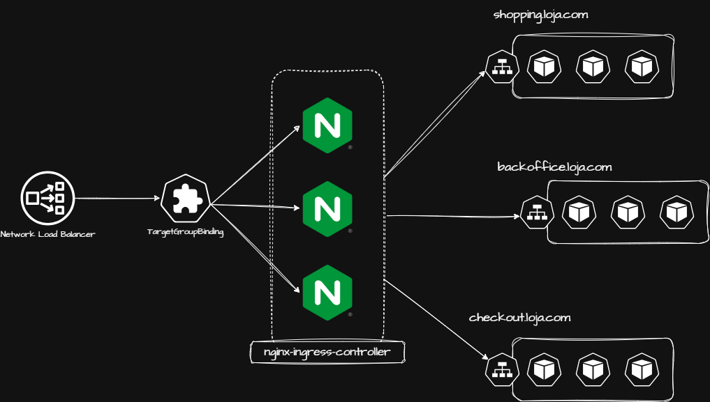

# Module 8: NGINX Ingress Controller

## Overview

[Module 7](../07%20-%20AWS%20Load%20Balancer%20Controller/README.md) ended with `TargetGroupBinding`: a way to let Kubernetes manage only the association between a Service and an AWS-provisioned target group, without Kubernetes ever creating or destroying the load balancer itself. This module puts that pattern to work for real: instead of provisioning one AWS load balancer per exposed service, we provision a single Network Load Balancer for the whole cluster and bind it to the **NGINX Ingress Controller** — Kubernetes' own default Ingress Controller.

```txt
One NLB (Layer 4, Terraform-managed) -> TargetGroupBinding -> NGINX Ingress Controller (Layer 7, Kubernetes-managed)
```

From that point on, exposing a new service is a Kubernetes-only operation: create an `Ingress` object with a host rule, and NGINX routes matching traffic to it. No new load balancer, no new listener rules in AWS — routing lives entirely inside Kubernetes. This module reuses the cluster and the NLB provisioned in Module 7 as its starting point.

## Table of Contents

- [Lesson 1: Why a Dedicated Ingress Controller](#lesson-1-why-a-dedicated-ingress-controller)
  - [1. Reusing the Load Balancer Controller Setup](#1-reusing-the-load-balancer-controller-setup)
  - [2. The Shared NLB Architecture](#2-the-shared-nlb-architecture)
  - [3. Why NGINX](#3-why-nginx)
  - [Key Takeaways](#key-takeaways)
- [Lesson 2: Installing NGINX and Binding It to the NLB](#lesson-2-installing-nginx-and-binding-it-to-the-nlb)
  - [1. Provisioning the Network Load Balancer](#1-provisioning-the-network-load-balancer)
  - [2. Installing the Controller with Helm](#2-installing-the-controller-with-helm)
  - [3. Linking the Controller to the NLB with Target Group Binding](#3-linking-the-controller-to-the-nlb-with-target-group-binding)
  - [4. Testing the Installation](#4-testing-the-installation)
  - [5. Enabling Autoscaling](#5-enabling-autoscaling)
  - [6. Setting Resource Requests and Limits](#6-setting-resource-requests-and-limits)
  - [Key Takeaways](#key-takeaways-1)
- [Lesson 3: Productionizing the Installation](#lesson-3-productionizing-the-installation)
  - [1. Parametrizing the Helm Values](#1-parametrizing-the-helm-values)
  - [2. Deployment vs DaemonSet](#2-deployment-vs-daemonset)
  - [Key Takeaways](#key-takeaways-2)
- [Lesson 4: Routing Multiple Services Through One Ingress Controller](#lesson-4-routing-multiple-services-through-one-ingress-controller)
  - [1. The Health API Lab](#1-the-health-api-lab)
  - [2. Exposing Only the Top-Level Service](#2-exposing-only-the-top-level-service)
  - [3. Deploying Health API](#3-deploying-health-api)
  - [4. Routing Chip Through NGINX](#4-routing-chip-through-nginx)
  - [5. Testing Host-Based Routing](#5-testing-host-based-routing)
  - [6. Swapping Ingress Controllers Without Touching the Load Balancer](#6-swapping-ingress-controllers-without-touching-the-load-balancer)
  - [Key Takeaways](#key-takeaways-3)

# Lesson 1: Why a Dedicated Ingress Controller

## 1. Reusing the Load Balancer Controller Setup

This module picks up exactly where [Module 7](../07%20-%20AWS%20Load%20Balancer%20Controller/README.md) left off: the same cluster, the same AWS Load Balancer Controller installation, and the same `TargetGroupBinding` CRD. The `chip` deployment from Module 7's final lesson is removed first, leaving the NLB and its target group provisioned but empty — this module reconnects that same target group to a different backend.

The reused setup still carries the IAM caveat flagged in Module 7: `iam_aws_load_balancer_controller.tf` attaches the controller's policy with the exclusive `aws_iam_policy_attachment` resource instead of `aws_iam_role_policy_attachment`. That's still worth fixing before running this in anything beyond a single-role lab cluster, for the same reason described there — an exclusive attachment silently detaches every other policy attached the same way to that role.

## 2. The Shared NLB Architecture



Every load balancer built in Module 7 was one-to-one: one Service or Ingress, one AWS load balancer. That doesn't scale well once a cluster hosts more than a handful of services — each one would mean its own NLB or ALB, its own listener rules, its own bill.

This module's architecture instead shares a single Network Load Balancer across the entire cluster:

```txt
Client -> NLB (Layer 4, one per cluster) -> NGINX Ingress Controller -> Ingress rules (host/path) -> Service
```

The NLB only forwards TCP traffic to the NGINX pods — it has no idea how many services exist behind it. All host- and path-based routing decisions happen inside Kubernetes, as `Ingress` objects that NGINX watches and turns into internal routing rules. Adding a new service no longer means provisioning a new load balancer; it means adding a new `Ingress`.

## 3. Why NGINX

The NGINX Ingress Controller is Kubernetes' own default, community-maintained Ingress Controller — the recommended starting point before reaching for anything more specialized (a service mesh's own ingress, for example, covered later in the course). It's simple, well-documented, and covers the overwhelming majority of routing needs: host-based and path-based rules, TLS termination, and rewrite rules, all through a well-known set of annotations and CRDs.

## Key Takeaways

- This module reuses Module 7's cluster, AWS Load Balancer Controller installation, and NLB/target group — only the target group's backend changes, from `chip` directly to the NGINX Ingress Controller.
- The architecture goes from one load balancer per service to one shared NLB per cluster, with all host/path routing decisions moved into Kubernetes `Ingress` objects instead of AWS listener rules.
- The `aws_iam_policy_attachment` anti-pattern flagged in Module 7 is still present in this branch's `iam_aws_load_balancer_controller.tf` — fix it the same way (`aws_iam_role_policy_attachment`) before using this as a starting point for anything beyond this lab.

# Lesson 2: Installing NGINX and Binding It to the NLB

## 1. Provisioning the Network Load Balancer

The NLB, target group, and listener are the exact same Terraform resources introduced in [Module 7, Lesson 5](../07%20-%20AWS%20Load%20Balancer%20Controller/README.md#3-provisioning-the-nlb-target-group-and-listener-with-terraform) — if that module's cluster is still up, this step is already done:

```hcl
resource "aws_lb" "ingress" {
  name = var.project_name

  internal           = false
  load_balancer_type = "network"

  subnets = data.aws_ssm_parameter.public_subnets[*].value

  enable_cross_zone_load_balancing = true
  enable_deletion_protection       = false

  tags = {
    Name = var.project_name
  }
}

resource "aws_lb_target_group" "main" {
  name     = format("%s-http", var.project_name)
  port     = 8080
  protocol = "TCP"
  vpc_id   = data.aws_ssm_parameter.vpc.value
}

resource "aws_lb_listener" "main" {
  load_balancer_arn = aws_lb.ingress.arn
  port              = 80
  protocol          = "TCP"

  default_action {
    type             = "forward"
    target_group_arn = aws_lb_target_group.main.arn
  }
}
```

## 2. Installing the Controller with Helm

The controller is installed from the project's official chart, `ingress-nginx`, the same way every other Helm-based component in this course has been installed — through a `helm_release` resource rather than the CLI:

```hcl
resource "helm_release" "nginx_controller" {
  name       = "ingress-nginx"
  namespace  = "ingress-nginx"
  chart      = "ingress-nginx"
  repository = "https://kubernetes.github.io/ingress-nginx"
  version    = "4.11.3"

  create_namespace = true

  set = [
    {
      name  = "controller.service.internal.enabled"
      value = "true"
    },
    {
      name  = "controller.publishService.enable"
      value = "true"
    },
    {
      name  = "controller.service.type"
      value = "NodePort"
    }
  ]

  depends_on = [
    helm_release.karpenter
  ]
}
```

The one setting that matters most here is `controller.service.type = "NodePort"`. The chart defaults this to `ClusterIP`, and most standalone NGINX guides set it to `LoadBalancer` — but neither works with the plan for this module. `TargetGroupBinding` with `targetType: instance` needs a `NodePort` Service: it registers each node's NodePort with the target group, the same exposure model `chip` used in Module 7's final lesson.

## 3. Linking the Controller to the NLB with Target Group Binding

With the controller installed, its `ingress-nginx-controller` Service is bound to the target group created above — the same `TargetGroupBinding` pattern from Module 7, just pointed at a different Service:

```hcl
resource "kubectl_manifest" "target_binding_80" {
  yaml_body = <<YAML
apiVersion: elbv2.k8s.aws/v1beta1
kind: TargetGroupBinding
metadata:
  name: ingress-nginx
  namespace: ingress-nginx
spec:
  serviceRef:
    name: ingress-nginx-controller
    port: 80
  targetGroupARN: ${aws_lb_target_group.main.arn}
  targetType: instance
YAML
  depends_on = [
    helm_release.nginx_controller
  ]
}
```

`targetGroupARN` is a live Terraform interpolation against `aws_lb_target_group.main.arn` — there's no ARN literal to manage or rotate, since Terraform fills it in directly from the resource created in the previous step.

## 4. Testing the Installation

```bash
terraform apply

kubectl get all -n ingress-nginx

kubectl describe targetgroupbinding ingress-nginx -n ingress-nginx
```

`kubectl describe` reports a successful reconciliation once the controller's endpoints are registered in the target group. At that point, hitting the NLB directly reaches NGINX itself — with no `Ingress` objects deployed yet, every request falls through to NGINX's own default backend:

```bash
curl http://<nlb-dns-name>/
# 404 Not Found
# nginx
```

That `404` — served by NGINX, not by AWS — confirms the whole chain works: NLB → NodePort → NGINX pod. The next lessons add `Ingress` objects to turn that `404` into real routing.

## 5. Enabling Autoscaling

By default, the chart deploys the controller with a single, fixed-size replica and no `HorizontalPodAutoscaler` — every request funnels through that one pod, which becomes the cluster's single point of failure for all inbound traffic. Autoscaling is off by default and needs to be turned on explicitly:

```hcl
    {
      name  = "controller.autoscaling.enabled"
      value = "true"
    },
    {
      name  = "controller.autoscaling.minReplicas"
      value = "3"
    },
    {
      name  = "controller.autoscaling.maxReplicas"
      value = "60"
    },
```

Re-applying creates an HPA scaling the controller's Deployment between 3 and 60 replicas on CPU and memory utilization:

```bash
kubectl get deployment -n ingress-nginx
kubectl get hpa -n ingress-nginx
```

## 6. Setting Resource Requests and Limits

The chart's default resource footprint is minimal — enough to demo the controller, not enough to size it for real traffic. `controller.resources` sets both requests and limits explicitly:

```hcl
    {
      name  = "controller.resources.requests.cpu"
      value = "250m"
    },
    {
      name  = "controller.resources.requests.memory"
      value = "512Mi"
    },
    {
      name  = "controller.resources.limits.cpu"
      value = "500m"
    },
    {
      name  = "controller.resources.limits.memory"
      value = "1024Mi"
    },
```

These specific numbers aren't derived from any load test — they're a reasonable starting point to size against, tuned later based on the HPA's real utilization once traffic arrives. The point isn't the exact values, it's knowing where the capacity knobs live before this becomes the cluster's single entry point for every service.

## Key Takeaways

- `controller.service.type = "NodePort"` is the one non-default setting that makes the NGINX Ingress Controller compatible with `TargetGroupBinding` and `targetType: instance` — the chart's own default (`ClusterIP`) and the commonly-used `LoadBalancer` both provision the wrong kind of Service for this pattern.
- Binding the controller's Service to the NLB's target group is the exact same `TargetGroupBinding` resource from Module 7 — only the `serviceRef` changes.
- Autoscaling (`controller.autoscaling.*`) and resource requests/limits (`controller.resources.*`) are both off/minimal by default — since this controller becomes the single entry point for every service behind it, both need to be set explicitly rather than left at chart defaults.

# Lesson 3: Productionizing the Installation

## 1. Parametrizing the Helm Values

Hard-coding replica counts and resource sizes directly into `set` blocks works for a demo, but it means editing the Helm release itself every time these numbers need to change. The same values from Lesson 2 move into Terraform variables instead:

```hcl
variable "nginx_min_replicas" {
  type    = string
  default = "3"
}

variable "nginx_max_replicas" {
  type    = string
  default = "60"
}

variable "nginx_requests_cpu" {
  type    = string
  default = "250m"
}

variable "nginx_requests_memory" {
  type    = string
  default = "512Mi"
}

variable "nginx_limits_cpu" {
  type    = string
  default = "500m"
}

variable "nginx_limits_memory" {
  type    = string
  default = "1024Mi"
}
```

The `helm_release` now references these variables instead of literal strings, giving the full picture of what the installation configures:

```hcl
resource "helm_release" "nginx_controller" {
  name       = "ingress-nginx"
  namespace  = "ingress-nginx"
  chart      = "ingress-nginx"
  repository = "https://kubernetes.github.io/ingress-nginx"
  version    = "4.11.3"

  create_namespace = true

  set = [
    {
      name  = "controller.service.internal.enabled"
      value = "true"
    },
    {
      name  = "controller.publishService.enable"
      value = "true"
    },
    {
      name  = "controller.service.type"
      value = "NodePort"
    },
    # Autoscaling
    {
      name  = "controller.autoscaling.enabled"
      value = "true"
    },
    {
      name  = "controller.autoscaling.minReplicas"
      value = tostring(var.nginx_min_replicas)
    },
    {
      name  = "controller.autoscaling.maxReplicas"
      value = tostring(var.nginx_max_replicas)
    },
    # Capacity
    {
      name  = "controller.resources.requests.cpu"
      value = var.nginx_requests_cpu
    },
    {
      name  = "controller.resources.requests.memory"
      value = var.nginx_requests_memory
    },
    {
      name  = "controller.resources.limits.cpu"
      value = var.nginx_limits_cpu
    },
    {
      name  = "controller.resources.limits.memory"
      value = var.nginx_limits_memory
    },
    {
      name  = "controller.kind"
      value = "Deployment"
      # value = "DaemonSet"
    }
  ]

  depends_on = [
    helm_release.karpenter
  ]
}
```

Now scaling the controller for a bigger cluster, or tuning its capacity after watching the HPA under real load, is a one-line variable change instead of an edit to the release itself.

## 2. Deployment vs DaemonSet

`controller.kind` controls the workload type behind the NGINX Ingress Controller, and it has two valid values:

```txt
Deployment -> scales horizontally based on the HPA (Lesson 2's controller.autoscaling.*)
DaemonSet  -> runs exactly one NGINX pod per node
```

A `DaemonSet` guarantees ingress capacity grows in lock-step with the node count — useful if the goal is "every node always has a local NGINX pod," which can shave off a network hop and adds availability in clusters with very few nodes. Its scaling is tied to cluster size rather than request load, though: it doesn't grow or shrink based on how much traffic NGINX is actually handling, the way a `Deployment` with an HPA does.

This module keeps `controller.kind = "Deployment"`, with the `DaemonSet` alternative left commented out in the `set` block above — horizontal scaling based on the HPA's CPU/memory metrics fits this course's Karpenter-driven, elastic node model better than tying ingress capacity to whatever node count Karpenter happens to be running at any given moment.

## Key Takeaways

- The replica counts and resource sizes from Lesson 2 move into `nginx_min_replicas`, `nginx_max_replicas`, `nginx_requests_cpu`, `nginx_requests_memory`, `nginx_limits_cpu`, and `nginx_limits_memory` — Terraform variables instead of literals in the `set` block, so tuning them doesn't mean editing the Helm release.
- `controller.kind` chooses between `Deployment` (scales with the HPA, based on load) and `DaemonSet` (one pod per node, scales with cluster size) — this module keeps `Deployment`.

# Lesson 4: Routing Multiple Services Through One Ingress Controller

## 1. The Health API Lab

To show the shared-NLB architecture with more than one backend, this lesson deploys **Health API**: a small lab of seven synchronous, RPC-style microservices — `health-api` itself plus six gRPC dependencies (`recommendations-grpc`, `bmr-grpc`, `imc-grpc`, `calories-grpc`, `proteins-grpc`, `water-grpc`) that fan out to compute a set of nutrition macros from a person's weight, height, and activity level.

## 2. Exposing Only the Top-Level Service

Every backend service is a plain `ClusterIP` with no `Ingress` of its own — they're only reachable from inside the cluster, by their in-cluster DNS names:

```txt
health-api  -> calls -> bmr-grpc.bmr.svc.cluster.local:30000
                        imc-grpc.imc.svc.cluster.local:30000
                        recommendations-grpc.recommendations.svc.cluster.local:30000
recommendations-grpc -> calls -> proteins-grpc.proteins.svc.cluster.local:30000
                                 water-grpc.water.svc.cluster.local:30000
                                 calories-grpc.calories.svc.cluster.local:30000
```

`health-api` is the only service in this whole call graph that gets an `Ingress` — the internal dependency chain resolves entirely through Kubernetes DNS and Service objects, without ever touching the Ingress Controller or the NLB.

## 3. Deploying Health API

`health-api`'s own manifest carries the `Ingress`, pointed at the same `nginx` `IngressClass` installed in Lesson 2:

```yaml
apiVersion: v1
kind: Namespace
metadata:
  name: health-api
---
apiVersion: networking.k8s.io/v1
kind: Ingress
metadata:
  name: health-api
  namespace: health-api
spec:
  ingressClassName: nginx
  rules:
    - host: health.luisgustavo.com.br
      http:
        paths:
          - pathType: Prefix
            backend:
              service:
                name: health-api
                port:
                  number: 8080
            path: /
---
apiVersion: apps/v1
kind: Deployment
metadata:
  labels:
    app: health-api
  name: health-api
  namespace: health-api
spec:
  replicas: 2
  selector:
    matchLabels:
      app: health-api
  template:
    metadata:
      annotations:
        prometheus.io/scrape: "true"
        prometheus.io/port: "8080"
      labels:
        app: health-api
        name: health-api
        version: v1
    spec:
      containers:
      - image: fidelissauro/health-api:latest
        name: health-api
        env:
        - name: ENVIRONMENT
          value: "dev"
        - name: BMR_SERVICE_ENDPOINT
          value: "bmr-grpc.bmr.svc.cluster.local:30000"
        - name: IMC_SERVICE_ENDPOINT
          value: "imc-grpc.imc.svc.cluster.local:30000"
        - name: RECOMMENDATIONS_SERVICE_ENDPOINT
          value: "recommendations-grpc.recommendations.svc.cluster.local:30000"
        ports:
        - containerPort: 8080
          name: http
        startupProbe:
          failureThreshold: 10
          httpGet:
            path: /healthcheck
            port: 8080
          periodSeconds: 10
        livenessProbe:
          failureThreshold: 10
          httpGet:
            path: /healthcheck
            port: 8080
      terminationGracePeriodSeconds: 60
---
apiVersion: v1
kind: Service
metadata:
  name: health-api
  namespace: health-api
  annotations:
    prometheus.io/scrape: "true"
    prometheus.io/port: "8080"
  labels:
    app.kubernetes.io/name: health-api
    app.kubernetes.io/instance: health-api
spec:
  ports:
  - name: web
    port: 8080
    protocol: TCP
  selector:
    app: health-api
  type: ClusterIP
```

The six backend gRPC services follow the same shape — their own `Namespace`, `Deployment`, and `ClusterIP` `Service`, no `Ingress` — each one only reachable by the endpoint one level above it in the call graph.

```bash
kubectl apply -f health-api.yml

kubectl get pods -A | grep -E "health-api|bmr|imc|recommendations|calories|proteins|water"
```

## 4. Routing Chip Through NGINX

`chip` — the app used throughout this course — comes back too, now on the same `nginx` `IngressClass` instead of the `alb` one used in Module 7:

```yaml
apiVersion: v1
kind: Namespace
metadata:
  name: chip
---
apiVersion: networking.k8s.io/v1
kind: Ingress
metadata:
  name: chip-ingress
  namespace: chip
  labels:
    app.kubernetes.io/name: chip
spec:
  ingressClassName: nginx
  rules:
    - host: chip.luisgustavo.com.br
      http:
        paths:
          - path: /
            pathType: Prefix
            backend:
              service:
                name: chip
                port:
                  number: 8080
---
apiVersion: apps/v1
kind: Deployment
metadata:
  labels:
    app: chip
  name: chip
  namespace: chip
spec:
  replicas: 3
  selector:
    matchLabels:
      app: chip
  template:
    metadata:
      labels:
        app: chip
        name: chip
        version: v1
    spec:
      topologySpreadConstraints:
        - maxSkew: 1
          topologyKey: "topology.kubernetes.io/zone"
          whenUnsatisfiable: ScheduleAnyway
          labelSelector:
            matchLabels:
              app: chip

        - maxSkew: 1
          topologyKey: "node.kubernetes.io/instance-type"
          whenUnsatisfiable: ScheduleAnyway
          labelSelector:
            matchLabels:
              app: chip

      containers:
      - name: chip
        image: fidelissauro/chip:v2
        ports:
        - containerPort: 8080
          name: http
        resources:
          requests:
            cpu: 250m
            memory: 512Mi
        startupProbe:
          failureThreshold: 10
          httpGet:
            path: /readiness
            port: 8080
          periodSeconds: 10
        livenessProbe:
          failureThreshold: 10
          httpGet:
            httpHeaders:
            - name: Custom-Header
              value: Awesome
            path: /liveness
            port: 8080
          periodSeconds: 10
      terminationGracePeriodSeconds: 60
---
apiVersion: v1
kind: Service
metadata:
  name: chip
  namespace: chip
  labels:
    app.kubernetes.io/name: chip
    app.kubernetes.io/instance: chip
spec:
  ports:
  - name: web
    port: 8080
    protocol: TCP
    targetPort: 8080
  selector:
    app: chip
```

```bash
kubectl apply -f chip-ingress.yml

kubectl get ingress -A
```

## 5. Testing Host-Based Routing

With both `Ingress` objects applied, `health-api` and `chip` are now served through the exact same NLB and the exact same NGINX Ingress Controller, differentiated purely by the `Host` header:

```bash
curl -H "Host: health.luisgustavo.com.br" http://<nlb-dns-name>/

curl -H "Host: chip.luisgustavo.com.br" http://<nlb-dns-name>/
```

Each request lands on its own service's pods, routed entirely by the `host` rule in its `Ingress` — the NLB and NGINX Deployment stay exactly as they were in Lesson 2, with no new AWS resources provisioned for either service.

## 6. Swapping Ingress Controllers Without Touching the Load Balancer

This is the payoff of the `TargetGroupBinding` architecture from Lesson 2: the NLB and its DNS name never change, no matter which Ingress Controller sits behind them. Swapping NGINX for a different implementation later in the course means changing one thing — the `serviceRef` inside `target_binding_80` — while every `Ingress` object, every `host` rule, and the NLB's own DNS name stay exactly as they are.

## Key Takeaways

- Only the top-level service in a call graph needs an `Ingress` — internal dependencies between microservices resolve through plain `ClusterIP` Services and in-cluster DNS, never through the Ingress Controller.
- Multiple unrelated services (`health-api`, `chip`) share the same NLB and the same NGINX Ingress Controller, distinguished only by the `host` rule in each one's own `Ingress` object.
- Because the load balancer is decoupled from Kubernetes via `TargetGroupBinding`, replacing the Ingress Controller implementation only requires updating the `TargetGroupBinding`'s `serviceRef` — the NLB, its DNS name, and every existing `Ingress` object are unaffected.
