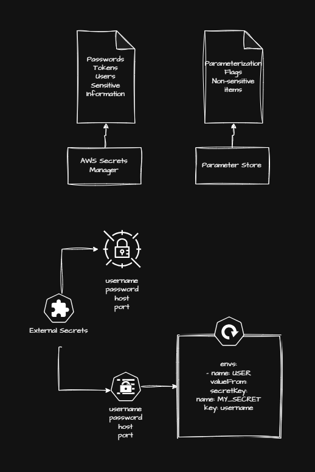

# Module 10: External Secrets

## Overview

Every `Secret` in this course, until now, has been created by hand: base64-encoded values typed directly into a Kubernetes manifest and applied like any other resource. This module changes that by installing the **External Secrets Operator (ESO)**, which lets a Kubernetes `Secret` be generated and kept in sync from a value that actually lives in AWS — either **AWS Secrets Manager**, for genuinely sensitive values like passwords and tokens, or **AWS Parameter Store**, for open, non-sensitive configuration.

Like Module 9's CSI drivers, External Secrets authenticates through **Pod Identity** rather than IRSA — reusing the same mechanism, just for a very different kind of workload. Unlike Module 9's drivers, though, External Secrets isn't distributed as an EKS Addon: it installs through its own Helm chart, which brings in the two CRDs — `SecretStore` and `ExternalSecret` — that every lesson in this module builds on.

## Table of Contents

- [Lesson 1: Introduction to External Secrets and Pod Identity Setup](#lesson-1-introduction-to-external-secrets-and-pod-identity-setup)
  - [1. Kubernetes Secrets vs. AWS-Managed Secret Stores](#1-kubernetes-secrets-vs-aws-managed-secret-stores)
  - [2. Secrets Manager, Parameter Store, and Why Not AppConfig](#2-secrets-manager-parameter-store-and-why-not-appconfig)
  - [3. Redeploying the Pod Identity Agent Addon](#3-redeploying-the-pod-identity-agent-addon)
  - [Key Takeaways](#key-takeaways)
- [Lesson 2: Installing External Secrets and Creating a Secrets Manager Secret](#lesson-2-installing-external-secrets-and-creating-a-secrets-manager-secret)
  - [1. Creating the IAM Role and Policy for External Secrets](#1-creating-the-iam-role-and-policy-for-external-secrets)
  - [2. Associating the Role via Pod Identity](#2-associating-the-role-via-pod-identity)
  - [3. Installing the External Secrets Operator with Helm](#3-installing-the-external-secrets-operator-with-helm)
  - [4. Verifying the Installation](#4-verifying-the-installation)
  - [5. Creating a Secret in AWS Secrets Manager](#5-creating-a-secret-in-aws-secrets-manager)
  - [Key Takeaways](#key-takeaways-1)
- [Lesson 3: SecretStore, ExternalSecret, and Wiring a Deployment](#lesson-3-secretstore-externalsecret-and-wiring-a-deployment)
  - [1. Understanding the SecretStore and ExternalSecret CRDs](#1-understanding-the-secretstore-and-externalsecret-crds)
  - [2. Creating the SecretStore and ExternalSecret](#2-creating-the-secretstore-and-externalsecret)
  - [3. Applying and Inspecting the Generated Kubernetes Secret](#3-applying-and-inspecting-the-generated-kubernetes-secret)
  - [4. Wiring the Secret into the Deployment](#4-wiring-the-secret-into-the-deployment)
  - [5. Testing Through Chip's Environment Endpoint](#5-testing-through-chips-environment-endpoint)
  - [Key Takeaways](#key-takeaways-2)
- [Lesson 4: JSON Multi-Value Secrets](#lesson-4-json-multi-value-secrets)
  - [1. Structuring a Secret as JSON](#1-structuring-a-secret-as-json)
  - [2. Creating an ExternalSecret with Multiple Keys](#2-creating-an-externalsecret-with-multiple-keys)
  - [3. Applying and Inspecting Two Data Keys](#3-applying-and-inspecting-two-data-keys)
  - [4. Wiring Two Environment Variables into the Deployment](#4-wiring-two-environment-variables-into-the-deployment)
  - [Key Takeaways](#key-takeaways-3)
- [Lesson 5: AWS Parameter Store Integration](#lesson-5-aws-parameter-store-integration)
  - [1. The Permissions Are Already in Place](#1-the-permissions-are-already-in-place)
  - [2. Creating a Parameter in SSM](#2-creating-a-parameter-in-ssm)
  - [3. Creating a ParameterStore-Backed SecretStore and ExternalSecret](#3-creating-a-parameterstore-backed-secretstore-and-externalsecret)
  - [4. Wiring and Verifying](#4-wiring-and-verifying)
  - [5. Wrapping Up: Secrets Manager vs. Parameter Store](#5-wrapping-up-secrets-manager-vs-parameter-store)
  - [Key Takeaways](#key-takeaways-4)

# Lesson 1: Introduction to External Secrets and Pod Identity Setup

## 1. Kubernetes Secrets vs. AWS-Managed Secret Stores

Every `Secret` used in this course so far has lived entirely inside the cluster: base64-encoded values baked directly into a manifest, applied by hand. That's fine for a lab, but it means the actual secret value is only ever as safe as the YAML file it's typed into, with no rotation, no audit trail, and no single source of truth shared across environments.

This module introduces the **External Secrets Operator (ESO)**, which bridges that gap: it watches an AWS-managed secret store, and keeps a native Kubernetes `Secret` in sync with whatever value lives there. Change the value in AWS, and ESO reflects it back into the cluster's `Secret` — either immediately or after a configured refresh interval — without anyone ever hand-editing a `Secret` manifest again.



## 2. Secrets Manager, Parameter Store, and Why Not AppConfig

AWS actually offers three services this kind of parametrization could come from, but only two of them get used in this module:

- **Secrets Manager** — for genuinely sensitive values: passwords, tokens, service-account credentials.
- **Parameter Store** (part of Systems Manager) — for open, non-sensitive configuration: flags, feature toggles, simple values that don't need the extra protections Secrets Manager provides.
- **AppConfig** — deliberately left out of this module. It solves a different problem: dynamic configuration that an application picks up live, without needing a pod restart. It has no direct CRD integration with External Secrets the way the other two do, so it doesn't fit the pattern this module is building.

Both Secrets Manager and Parameter Store plug into External Secrets through the exact same CRDs — the only difference, as the lessons ahead show, is which `provider.aws.service` a `SecretStore` points at.

## 3. Redeploying the Pod Identity Agent Addon

This module reuses **Pod Identity** as its IAM authentication mechanism — introduced back in [Module 9](../09%20-%20Storage%20in%20EKS/README.md) for the CSI drivers, and used here just as heavily. Since each module in this course branches independently, the Pod Identity Agent addon has to be redeployed on this branch before anything else:

```hcl
# addons.tf
resource "aws_eks_addon" "pod_identity" {
  cluster_name = aws_eks_cluster.main.name
  addon_name   = "eks-pod-identity-agent"

  addon_version               = var.addon_pod_identity_version
  resolve_conflicts_on_create = "OVERWRITE"
  resolve_conflicts_on_update = "OVERWRITE"

  depends_on = [
    aws_eks_access_entry.nodes
  ]
}
```

Same resource, same `addon_pod_identity_version` variable, copied straight over from Module 9. Given how often this course reaches for Pod Identity now, it's treated as baseline infrastructure — the kind of resource that gets committed straight to the shared branch, rather than something scoped narrowly to a single lesson.

With the addon back in place, the module's actual subject — installing External Secrets itself — starts in Lesson 2.

## Key Takeaways

- External Secrets Operator (ESO) keeps a native Kubernetes `Secret` synced with a value living in an AWS-managed store, instead of that value being hand-typed into a manifest.
- Secrets Manager is for sensitive values (passwords, tokens, credentials); Parameter Store is for open configuration; AppConfig is out of scope for this module since it has no CRD integration with ESO.
- Pod Identity, introduced in Module 9, is reused as this module's IAM mechanism and gets redeployed first, since each module branches independently.

# Lesson 2: Installing External Secrets and Creating a Secrets Manager Secret

## 1. Creating the IAM Role and Policy for External Secrets

Before installing anything, External Secrets needs an IAM role it can assume through Pod Identity, and a policy scoped to what it actually needs to read: Secrets Manager, Parameter Store, and the KMS decrypt permission secrets encrypted at rest require.

```hcl
# iam_external_secrets.tf
data "aws_iam_policy_document" "external_secrets_role" {
  statement {
    effect = "Allow"

    principals {
      type        = "Service"
      identifiers = ["pods.eks.amazonaws.com"]
    }

    actions = [
      "sts:AssumeRole",
      "sts:TagSession"
    ]
  }
}

resource "aws_iam_role" "external_secrets_role" {
  assume_role_policy = data.aws_iam_policy_document.external_secrets_role.json
  name               = format("%s-external-secrets", var.project_name)
}

data "aws_iam_policy_document" "external_secrets_policy" {
  version = "2012-10-17"

  statement {

    effect = "Allow"
    actions = [
      "secretsmanager:ListSecrets",
      "secretsmanager:GetResourcePolicy",
      "secretsmanager:GetSecretValue",
      "secretsmanager:DescribeSecret",
      "secretsmanager:ListSecretVersionIds"
    ]

    resources = [
      "*"
    ]

  }

  statement {

    effect = "Allow"
    actions = [
      "ssm:GetParameter*"
    ]

    resources = [
      "*"
    ]

  }

  statement {

    effect = "Allow"
    actions = [
      "kms:Decrypt"
    ]

    resources = [
      "*"
    ]

  }
}

resource "aws_iam_policy" "external_secrets_policy" {
  name   = format("%s-external-secrets", var.project_name)
  path   = "/"
  policy = data.aws_iam_policy_document.external_secrets_policy.json
}

resource "aws_iam_role_policy_attachment" "external_secrets_role" {
  policy_arn = aws_iam_policy.external_secrets_policy.arn
  role       = aws_iam_role.external_secrets_role.name
}
```

Same trust-policy shape from Module 9 — trusting `pods.eks.amazonaws.com`, granting `sts:AssumeRole` and `sts:TagSession`. The three permission statements are deliberately broad (`resources = ["*"]`), which is fine for a lab where every secret in the account belongs to this same cluster — in a real environment, this should be scoped down to the specific secret/parameter ARNs the workload actually reads.

## 2. Associating the Role via Pod Identity

```hcl
# iam_external_secrets.tf
resource "aws_eks_pod_identity_association" "external_secrets" {
  cluster_name    = aws_eks_cluster.main.name
  namespace       = "external-secrets"
  service_account = "external-secrets"
  role_arn        = aws_iam_role.external_secrets_role.arn
}
```

Both the namespace and the service account are named `external-secrets` — this matters, because it has to match exactly what the Helm chart creates in the next step. Unlike Module 9's addon-installed drivers, nothing here creates the namespace or service account ahead of time; the association is declared before the Helm release even exists, which is fine, since Terraform just registers the mapping — it takes effect the moment a matching service account shows up.

## 3. Installing the External Secrets Operator with Helm

Unlike the CSI drivers from Module 9, External Secrets isn't available as an EKS Addon — it's installed the same way most third-party Kubernetes tooling is, through its official Helm chart:

```hcl
# helm_external_secrets.tf
resource "helm_release" "external_secrets" {
  namespace        = "external-secrets"
  create_namespace = true

  name       = "external-secrets"
  repository = "https://charts.external-secrets.io"
  chart      = "external-secrets"

  set = [
    {
      name  = "installCRDs"
      value = "true"
    }
  ]

  depends_on = [
    aws_eks_cluster.main,
    aws_eks_node_group.main,
    aws_eks_pod_identity_association.external_secrets
  ]

}
```

`installCRDs = "true"` is what brings in the `SecretStore` and `ExternalSecret` CustomResourceDefinitions used in every lesson from here on — without it, the chart installs only the controller, with no CRDs for it to actually watch. The explicit `depends_on` on the Pod Identity association matters too: it makes sure the IAM binding exists before the chart creates the `external-secrets` service account that binding targets.

One thing worth noticing: unlike the addon versions pinned everywhere in Module 9 through a dedicated Terraform variable, this `helm_release` doesn't pin a chart version at all — every `apply` pulls whatever's currently newest from the `external-secrets` Helm repo. Fine for a lab that gets rebuilt from scratch each time, but worth adding a `version` argument in anything meant to be reproducible.

## 4. Verifying the Installation

```bash
kubectl get pods -n external-secrets
```

Three pods come up in the new `external-secrets` namespace: the controller itself, a certificate controller, and a webhook — all part of the same chart. The EKS console's Pod Identity Associations panel also shows the new `external-secrets` association, confirming the binding took effect.

## 5. Creating a Secret in AWS Secrets Manager

With External Secrets running, the first thing to actually sync is a Secrets Manager secret — created with the same two-resource pattern the AWS provider always uses: the secret container, and a version holding its actual value.

```hcl
# secrets_manager.tf
resource "aws_secretsmanager_secret" "teste" {
  name = "chip-teste"
}

resource "aws_secretsmanager_secret_version" "teste" {
  secret_id     = aws_secretsmanager_secret.teste.id
  secret_string = "BAR"
}
```

Once applied, the Secrets Manager console shows `chip-teste`, and its **Retrieve secret value** button reveals the plaintext `BAR` — confirming the secret exists and holds the expected value before touching Kubernetes at all.

## Key Takeaways

- External Secrets needs its own Pod Identity role, scoped to Secrets Manager, Parameter Store, and KMS decrypt — installed the same way as Module 9's CSI drivers, just with broader permissions since this one role backs every secret and parameter the cluster will read.
- The Pod Identity association's namespace/service account (`external-secrets`/`external-secrets`) must match exactly what the Helm chart creates — Terraform can declare the association before the chart even runs.
- External Secrets installs via its official Helm chart, not an EKS Addon; `installCRDs = "true"` is what brings in the `SecretStore`/`ExternalSecret` CRDs used from here on.
- `aws_secretsmanager_secret` plus `aws_secretsmanager_secret_version` is the minimal two-resource pattern for any Secrets Manager value — the version resource holds the actual string.

# Lesson 3: SecretStore, ExternalSecret, and Wiring a Deployment

## 1. Understanding the SecretStore and ExternalSecret CRDs

External Secrets works through two CRDs with a deliberate one-to-many relationship:

- **`SecretStore`** — declares *where* to look: which AWS service (`SecretsManager` or `ParameterStore`), which region. A `SecretStore` is scoped to a single namespace, and it's common to keep one per namespace, or even one per application.
- **`ExternalSecret`** — declares *what* to pull from that store, and *what Kubernetes `Secret` to create* with it. Multiple `ExternalSecret` resources can point at the same `SecretStore`.

The relationship between the two takes a bit of getting used to: an `ExternalSecret` doesn't update an existing `Secret` — it creates one from scratch, named whatever `target.name` says, the moment it's applied.

## 2. Creating the SecretStore and ExternalSecret

```yaml
# chip-external-secrets.yml
apiVersion: v1
kind: Namespace
metadata:
  name: chip
---
apiVersion: external-secrets.io/v1beta1
kind: SecretStore
metadata:
  name: chip-secret-store
  namespace: chip
spec:
  provider:
    aws:
      service: SecretsManager
      region: us-east-1
---
apiVersion: external-secrets.io/v1beta1
kind: ExternalSecret
metadata:
  name: chip-external-secret
  namespace: chip
spec:
  refreshInterval: 1h
  secretStoreRef:
    name: chip-secret-store
    kind: SecretStore
  target:
    # Name of the Secret that will be created in Kubernetes to hold the values
    name: chip-aws-secret
    creationPolicy: Owner
  data:
    # Key of the Kubernetes Secret where the Secrets Manager value will be stored
  - secretKey: FOO
    remoteRef:
      # The name of the Secrets Manager secret
      key: chip-teste
      # Empty property - stored as plaintext
      property: ""
```

A few fields worth calling out individually, since this CRD reads a little confusingly the first time through:

- `secretStoreRef` is what ties this `ExternalSecret` back to the `SecretStore` above.
- `target.name` is the Kubernetes `Secret` this resource is about to create — `chip-aws-secret`, in this case — with `creationPolicy: Owner` meaning External Secrets fully owns its lifecycle, deleting it if the `ExternalSecret` itself is deleted.
- `data[].secretKey` is the key that ends up inside that new Kubernetes `Secret`'s data. `data[].remoteRef.key` is the name of the thing in Secrets Manager (`chip-teste`, from Lesson 2). `remoteRef.property` is left empty here because `chip-teste` is a plain string, not JSON — an empty `property` means "use the whole value as-is."
- `refreshInterval: 1h` is how often External Secrets re-checks Secrets Manager for a changed value and re-syncs it.

## 3. Applying and Inspecting the Generated Kubernetes Secret

```bash
kubectl apply -f chip-external-secrets.yml
kubectl get secrets -n chip
kubectl get externalsecret -n chip
kubectl describe secret chip-aws-secret -n chip
```

`chip-aws-secret` shows up under `kubectl get secrets` — nobody created it by hand, the `ExternalSecret` controller did. `kubectl get externalsecret` confirms the sync status itself, showing the secret as synced once everything lines up. `describe secret` shows a single key, `FOO`, holding a base64-encoded value that decodes back to `BAR` — the exact value set in Secrets Manager in Lesson 2.

## 4. Wiring the Secret into the Deployment

From here on, it's exactly the same as wiring up any ordinary, hand-created Kubernetes `Secret` — External Secrets' job ends the moment the `Secret` object exists:

```yaml
# chip-external-secrets.yml (continued)
apiVersion: apps/v1
kind: Deployment
metadata:
  labels:
    app: chip
  name: chip
  namespace: chip
spec:
  replicas: 1
  selector:
    matchLabels:
      app: chip
  template:
    metadata:
      labels:
        app: chip
        name: chip
        version: v1
    spec:
      containers:
      - name: chip
        image: fidelissauro/chip:v1
        ports:
        - containerPort: 8080
          name: http
        resources:
          requests:
            cpu: 250m
            memory: 512Mi
        startupProbe:
          failureThreshold: 10
          httpGet:
            path: /readiness
            port: 8080
          periodSeconds: 10
        livenessProbe:
          failureThreshold: 10
          httpGet:
            httpHeaders:
            - name: Custom-Header
              value: Awesome
            path: /liveness
            port: 8080
          periodSeconds: 10
        env:
        - name: CHAOS_MONKEY_ENABLED
          value: "false"

        # Set the environment variable with the value from the Secrets Manager Secret
        - name: FOO
          valueFrom:
            secretKeyRef:
              name: chip-aws-secret
              key: "FOO"
      terminationGracePeriodSeconds: 60
---
apiVersion: v1
kind: Service
metadata:
  name: chip
  namespace: chip
  labels:
    app.kubernetes.io/name: chip
    app.kubernetes.io/instance: chip
spec:
  ports:
  - name: web
    port: 8080
    protocol: TCP
  selector:
    app: chip
  type: ClusterIP
```

```bash
kubectl apply -f chip-external-secrets.yml
kubectl get pods -n chip
kubectl describe pod -n chip -l app=chip
```

`describe pod` shows the `FOO` environment variable, sourced from `chip-aws-secret`'s `FOO` key — indistinguishable, from the pod's point of view, from a `Secret` someone typed in by hand.

## 5. Testing Through Chip's Environment Endpoint

```bash
kubectl run bastionpod --rm -i --tty --image debian -n default -- bash
apt-get update && apt-get install -y curl
curl http://chip.chip.svc.cluster.local:8080/system/environment | jq .
```

`chip` has an endpoint purely for lab/debugging purposes that dumps every environment variable it received, as JSON — `FOO: BAR` shows up in that dump, confirming the whole chain end-to-end: a value set in Secrets Manager, synced into a Kubernetes `Secret` by External Secrets, and injected into the pod as a plain environment variable, without ever being typed into a manifest.

## Key Takeaways

- `SecretStore` declares where to look (which AWS service, which region); `ExternalSecret` declares what to pull and what Kubernetes `Secret` to create from it — one `SecretStore` can back many `ExternalSecret` resources.
- An `ExternalSecret` creates its target `Secret` from scratch; it isn't applied on top of one that already exists.
- An empty `remoteRef.property` means "use the whole remote value as-is" — meaningful once Lesson 4 introduces JSON secrets with multiple properties.
- Once the `Secret` exists, wiring it into a Deployment is identical to using any hand-created `Secret` — `secretKeyRef` doesn't know or care that External Secrets created it.

# Lesson 4: JSON Multi-Value Secrets

## 1. Structuring a Secret as JSON

Instead of one Secrets Manager entry per value, a single secret can hold a whole JSON object — letting one `ExternalSecret` pull several distinct values out of it by property name:

```hcl
# secrets_manager.tf
resource "aws_secretsmanager_secret" "teste_json" {
  name = "chip-teste-json"
}

resource "aws_secretsmanager_secret_version" "teste_json" {
  secret_id = aws_secretsmanager_secret.teste_json.id
  secret_string = jsonencode({
    foo      = "BAR",
    username = "admin",
    password = "abc123"
  })
}
```

`jsonencode(...)` is what turns that Terraform object into the JSON string Secrets Manager actually stores. Once applied, retrieving `chip-teste-json` in the console shows it rendered as a proper key/value table — Secrets Manager understands it's JSON and displays it accordingly, rather than as one opaque blob.

## 2. Creating an ExternalSecret with Multiple Keys

```yaml
# chip-json.yml
apiVersion: v1
kind: Namespace
metadata:
  name: chip
---
apiVersion: external-secrets.io/v1beta1
kind: SecretStore
metadata:
  name: chip-secret-store
  namespace: chip
spec:
  provider:
    aws:
      service: SecretsManager
      region: us-east-1
---
apiVersion: external-secrets.io/v1beta1
kind: ExternalSecret
metadata:
  name: chip-external-secret-json
  namespace: chip
spec:
  refreshInterval: 1h
  secretStoreRef:
    name: chip-secret-store
    kind: SecretStore
  target:
    # Name of the Secret that will be created in Kubernetes to hold the values
    name: chip-aws-secret-json
    creationPolicy: Owner
  data:
    # Key of the Kubernetes Secret where the Secrets Manager value will be stored
  - secretKey: USER
    remoteRef:
      # The name of the Secrets Manager secret
      key: chip-teste-json
      # Will look up the "username" property in the Secrets Manager JSON
      property: "username"
  - secretKey: PASS
    remoteRef:
      # The name of the Secrets Manager secret
      key: chip-teste-json
      # Will look up the "password" property in the Secrets Manager JSON
      property: "password"
```

This reuses the same `chip-secret-store` `SecretStore` from Lesson 3 — a `SecretStore` isn't tied to a single secret, so pointing a second `ExternalSecret` at it is enough. The difference from Lesson 3 is entirely in `data`: two entries, both with `remoteRef.key: chip-teste-json`, but each with a different non-empty `property`, pulling out just that one field from the JSON blob.

## 3. Applying and Inspecting Two Data Keys

```bash
kubectl apply -f chip-json.yml
kubectl get secrets -n chip
kubectl describe secret chip-aws-secret-json -n chip
```

`chip-aws-secret-json` comes back with two data keys, `USER` and `PASS`, each independently base64-encoded — decoding them gives back `admin` and `abc123`, exactly the two properties named in the `ExternalSecret` above, pulled out of the same underlying JSON secret.

## 4. Wiring Two Environment Variables into the Deployment

```yaml
# chip-json.yml (continued)
        env:
        - name: CHAOS_MONKEY_ENABLED
          value: "false"

        # Set the environment variable with the value from the Secrets Manager Secret
        - name: USERNAME
          valueFrom:
            secretKeyRef:
              name: chip-aws-secret-json
              key: "USER"

        - name: PASSWORD
          valueFrom:
            secretKeyRef:
              name: chip-aws-secret-json
              key: "PASS"
```

```bash
kubectl apply -f chip-json.yml
curl http://chip.chip.svc.cluster.local:8080/system/environment
```

The environment dump now shows `USERNAME: admin` and `PASSWORD: abc123` — two separate environment variables, both sourced from the very same Secrets Manager entry. This is the actual payoff of storing a secret as JSON: one Secrets Manager entry can back an application's entire set of credentials, instead of needing a separate secret per value.

## Key Takeaways

- A single Secrets Manager secret can hold a JSON object (via `jsonencode(...)`), letting multiple `ExternalSecret` `data` entries pull out individual properties by name.
- A non-empty `remoteRef.property` is what selects one field out of a JSON secret — contrast with Lesson 3's empty `property`, which took the whole plaintext value.
- Multiple `ExternalSecret` resources, and multiple Kubernetes `Secret` targets, can all point back at the same `SecretStore` and the same underlying remote secret.

# Lesson 5: AWS Parameter Store Integration

## 1. The Permissions Are Already in Place

The IAM policy created back in Lesson 2 already included `ssm:GetParameter*`, specifically so this lesson wouldn't need to circle back and re-touch IAM at all — the same `external_secrets_role` used for Secrets Manager already has everything it needs to read from Parameter Store too.

## 2. Creating a Parameter in SSM

```hcl
# ssm.tf
resource "aws_ssm_parameter" "teste" {
  name  = "/Parameter/chip-teste-parameter"
  type  = "String"
  value = "FROM PARAMETER STORE"
}
```

Once applied, the Systems Manager console's Parameter Store section shows `/Parameter/chip-teste-parameter` with that exact value — Parameter Store names are commonly path-namespaced like this (the leading `/Parameter/` segment), which is why the resource's `name` looks more like a filesystem path than a typical secret name.

## 3. Creating a ParameterStore-Backed SecretStore and ExternalSecret

```yaml
# chip-ssm.yml
apiVersion: v1
kind: Namespace
metadata:
  name: chip
---
apiVersion: external-secrets.io/v1beta1
kind: SecretStore
metadata:
  name: chip-secret-store-ssm
  namespace: chip
spec:
  provider:
    aws:
      service: ParameterStore
      region: us-east-1
---
apiVersion: external-secrets.io/v1beta1
kind: ExternalSecret
metadata:
  name: chip-external-parameter
  namespace: chip
spec:
  refreshInterval: 1h
  secretStoreRef:
    name: chip-secret-store-ssm
    kind: SecretStore
  target:
    # Name of the Secret that will be created in Kubernetes to hold the values
    name: chip-aws-parameters
    creationPolicy: Owner
  data:
    # Key of the Kubernetes Secret where the Secrets Manager value will be stored
  - secretKey: PARAMETER_EXEMPLE
    remoteRef:
      # The name of the Parameter Store parameter
      key: "/Parameter/chip-teste-parameter"
      # Empty property - stored as plaintext
      property: ""
```

The whole shape carries over from Secrets Manager unchanged — same `SecretStore`/`ExternalSecret` CRDs, same `data[].secretKey`/`remoteRef` structure. The only thing that actually changes is `provider.aws.service: ParameterStore` instead of `SecretsManager`, and `remoteRef.key` pointing at the parameter's path instead of a secret name. External Secrets treats both providers through the same interface, which is exactly why adding a second backend here didn't require learning a new CRD.

## 4. Wiring and Verifying

```yaml
# chip-ssm.yml (continued)
        env:
        - name: CHAOS_MONKEY_ENABLED
          value: "false"

        # Set the environment variable with the value from the Secrets Manager Secret
        - name: PARAMETER_EXEMPLE
          valueFrom:
            secretKeyRef:
              name: chip-aws-parameters
              key: "PARAMETER_EXEMPLE"
```

```bash
kubectl apply -f chip-ssm.yml
curl http://chip.chip.svc.cluster.local:8080/system/environment
```

`PARAMETER_EXEMPLE: FROM PARAMETER STORE` shows up in the environment dump — the same end-to-end chain as Secrets Manager, just sourced from Parameter Store instead.

## 5. Wrapping Up: Secrets Manager vs. Parameter Store

| | Secrets Manager | Parameter Store |
|---|---|---|
| Intended for | Passwords, tokens, service credentials | Open configuration, flags, non-sensitive values |
| CRD used | `SecretStore` / `ExternalSecret` (same CRDs) | `SecretStore` / `ExternalSecret` (same CRDs) |
| `provider.aws.service` | `SecretsManager` | `ParameterStore` |
| JSON multi-value support | Yes (Lesson 4) | Yes, same `property` mechanism |

Both backends plug into exactly the same External Secrets machinery — the choice between them comes down to what's actually being stored, not any difference in how Kubernetes consumes it.

## Key Takeaways

- Parameter Store needs no new IAM permissions here — the `ssm:GetParameter*` action was already granted back in Lesson 2, anticipating this lesson.
- Switching a `SecretStore` from Secrets Manager to Parameter Store only changes `provider.aws.service` and the `remoteRef.key` format — every other CRD field stays the same.
- Both providers support the same `property`-based extraction for JSON-structured values.
- The choice between Secrets Manager and Parameter Store is about sensitivity, not capability — External Secrets treats both the same way once a `SecretStore` is configured.
